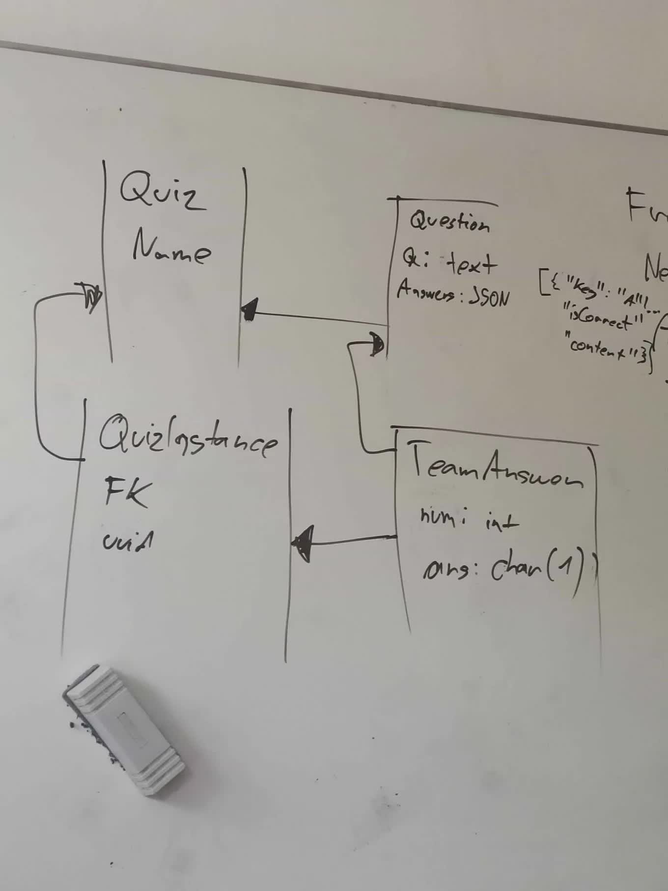
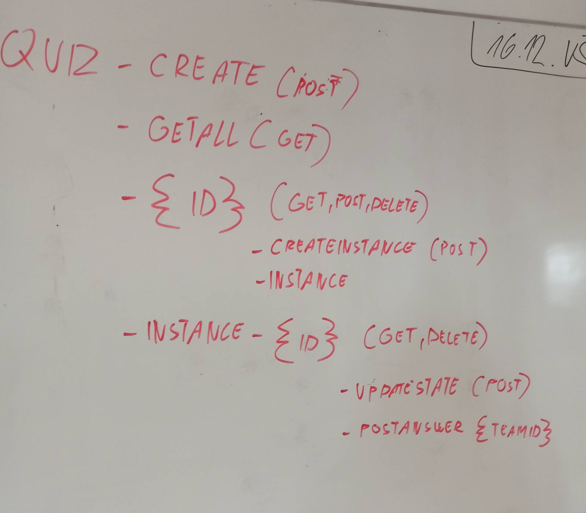

# Lepší než áčko backend

## POST `/quiz`

Create quiz

### Request Payload

- Type: JSON
- Structure:
    ```json
    {
      "name": <string>,
      "questions": [
        {
          "text": <string>,
          "answers": [
            {
              "text": <string>,
              "isCorrect": <bool>
            }
          ]
        }
      ]
    }
    ```

### Response Payloads

- HTTP 201 (CREATED): <uuid string>
- HTTP 500 (INTERNAL SERVER ERROR): <error string>

## GET `/quiz`

Get all quizzes

- No Request Payload

### Response Payloads

- HTTP 200 (OK):
    - Type: JSON
    - Structure:
        ```json
        [
          {
            "id": <uuid string>,
            "name": <string>,
            "questions": [
              {
                "id": <uuid string>,
                "text": <string>,
                "answers": [
                  {
                    "id": <uuid string>,
                    "text": <string>,
                    "isCorrect": <bool>
                  }
                ]
              }
            ]
          }
        ]
        ```
- HTTP 500 (INTERNAL SERVER ERROR): <error string>

## GET `/quiz/<id>`

Get quiz by ID

- No Request Payload

### Response Payloads

- HTTP 200 (OK):
    - Type: JSON
    - Structure:
        ```json
        {
          "id": <uuid string>,
          "name": <string>,
          "questions": [
            {
              "id": <uuid string>,
              "text": <string>,
              "answers": [
                {
                  "id": <uuid string>,
                  "text": <string>,
                  "isCorrect": <bool>
                }
              ]
            }
          ]
        }
        ```
- HTTP 404 (NOT FOUND): <error string>
- HTTP 500 (INTERNAL SERVER ERROR): <error string>

## POST `/quiz/<id>`

Update quiz with ID

### Request Payload

- Type: JSON
- Structure:
    ```json
    {
      "name": <string>,
      "questions": [
        {
          "text": <string>,
          "answers": [
            {
              "text": <string>,
              "isCorrect": <bool>
            }
          ]
        }
      ]
    }
    ```

### Response Payloads

- HTTP 200 (OK)
- HTTP 404 (NOT FOUND): <error string>
- HTTP 500 (INTERNAL SERVER ERROR): <error string>

## DELETE `/quiz/<id>`

Delete quiz with ID

- No Request Payload

### Response Payloads

- HTTP 200 (OK)
- HTTP 404 (NOT FOUND): <error string>
- HTTP 500 (INTERNAL SERVER ERROR): <error string>

## POST `/quiz/<id>/instance`

Create quiz instance

- No Request Payload

### Response Payloads

- HTTP 201 (CREATED): <uuid string>
- HTTP 404 (NOT FOUND): <error string>
- HTTP 500 (INTERNAL SERVER ERROR): <error string>

## GET `/quiz/instance/<id>`

Get quiz instance by ID

- No Request Payload

### Response Payloads

- HTTP 200 (OK):
    - Type: JSON
    - Structure:
        ```json
        {
          "quizId": <uuid string>,
          "state": <"active", "completed" or "paused">
        }
        ```
- HTTP 404 (NOT FOUND): <error string>
- HTTP 500 (INTERNAL SERVER ERROR): <error string>

## DELETE `/quiz/instance/<id>`

Delete quiz instance with ID

- No Request Payload

### Response Payloads

- HTTP 200 (OK)
- HTTP 404 (NOT FOUND): <error string>
- HTTP 500 (INTERNAL SERVER ERROR): <error string>

## POST `/quiz/instance/<id>/state`

Update quiz instance state

### Request Payload

- Type: string, "active", "completed" or "paused"

### Response Payloads

- HTTP 200 (OK)
- HTTP 404 (NOT FOUND): <error string>
- HTTP 500 (INTERNAL SERVER ERROR): <error string>

## GET `/quiz/instance/<id>/answer`

Get all answers

- No Request Payload

### Response Payloads

- HTTP 200 (OK):
    - Type: JSON
    - Structure:
        ```json
        [
            {
              "id": <uuid string>,
              "questionId": <uuid string>,
              "answerId": <uuid string>
              "team": <integer>,
            }
        ]
        ```
- HTTP 404 (NOT FOUND): <error string>
- HTTP 500 (INTERNAL SERVER ERROR): <error string>

## POST `/quiz/instance/<id>/answer`

Post answer

### Request Payload

- Type: JSON
- Structure:
    ```json
    {
      "questionId": <uuid string>,
      "answerId": <uuid string>
      "team": <integer>,
    }
    ```

### Response Payloads

- HTTP 200 (OK)
- HTTP 404 (NOT FOUND): <error string>
- HTTP 500 (INTERNAL SERVER ERROR): <error string>

## Environment variables

- DATABASE_URL: PostgreSQL database URL
- ROUTER_URL: the router will listen on this URL, optional, defaults to 127.0.0.1:6767

## Hard-reset database

```sh
docker compose down -v
docker compose up -d
sqlx migrate run
```

## Schéma databáze (deprecated)



## Endpointy (deprecated)


